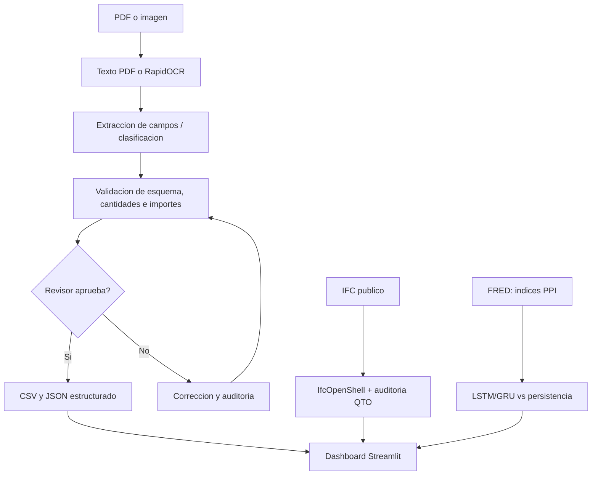

# Arquitectura lógica

```mermaid
flowchart TD
    A[PDF o imagen] --> B[Texto PDF o RapidOCR]
    B --> C[Extraccion de campos / clasificacion]
    C --> D[Validacion de esquema, cantidades e importes]
    D --> E{Revisor aprueba?}
    E -->|Si| F[CSV y JSON estructurado]
    E -->|No| G[Correccion y auditoria]
    G --> D
    I[IFC publico] --> J[IfcOpenShell + auditoria QTO]
    K[FRED: indices PPI] --> L[LSTM/GRU vs persistencia]
    F --> M[Dashboard Streamlit]
    J --> M
    L --> M
```

No hay integración directa todavía a ERP, Dynamo, Grasshopper ni Revit. Las salidas del prototipo pueden servir de contrato de intercambio para futuras integraciones.
